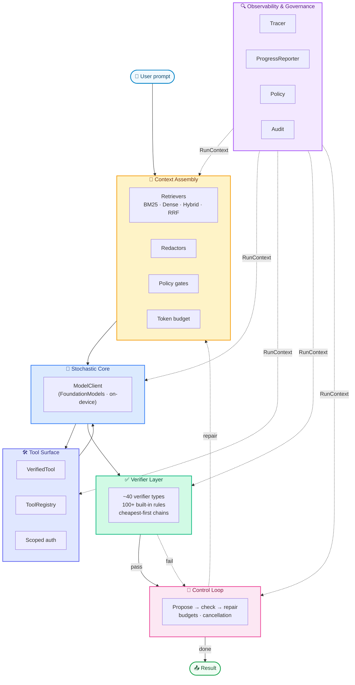

# Compound

**A surgical instrument for building compound AI systems in Swift. Apple-first, on-device, no apologies.**

The model is a beautiful liar. It is fluent, confident, and wrong on its own schedule. Every framework that hands you raw model output and calls it a product is selling you that lie wholesale. Compound refuses the sale.

Compound builds the [Compound AI Systems][doc] pattern on top of Apple's on-device `FoundationModels`: a stochastic component (the model) wired to a constellation of deterministic components (verifiers, typed tools, structured retrieval, observability, governance). What you ship is governed by the part that does not hallucinate.

The model proposes; the system disposes.

No external LLM API is ever called. There is no key to leak, no per-token meter ticking against you, no frontier-model vendor whose pricing and politics you do not control. The stochastic core is Apple's on-device `SystemLanguageModel`, reached through `FoundationModels`. Privacy, latency, and cost stay where they belong — under your hand. The tools that promised to solve your problem were too often built to harvest it. This one was not.

[doc]: https://bair.berkeley.edu/blog/2024/02/18/compound-ai-systems/

## Requirements

- Swift 6.2
- iOS 26 / iPadOS 26 / macOS 26 / visionOS 26
- Apple Intelligence available on the device

## Install

Add this to your `Package.swift`:

```swift
.package(url: "git@github.com:antisynthesis/compound.git", branch: "main")
```

Then add `Compound` to your target dependencies. That's it.

## Quick start

```swift
import Compound
import FoundationModels

let session = CompoundSession(.init(
    assembler: DefaultContextAssembler(
        baseInstructions: "You are a helpful, concise assistant.",
        redactors: [try CommonRedactors.email()]
    ),
    outputVerifier: VerifierChain(name: "output", [
        EncodingVerifier().erased(),
        SecretsVerifier().erased(),
        LanguageVerifier(allowed: [.english]).erased(),
    ]),
    tracer: CompositeTracer([OSLogTracer(), SignpostTracer()]),
    budget: .default
))

let outcome = try await session.respond(to: "Summarize compound AI systems in one paragraph.")
print(outcome.output)
```

Streaming into a SwiftUI view:

```swift
let run = try await session.stream(userPrompt: "Tell me a story.")
for try await event in run.stream {
    if case .modelStreamChunk(_, let delta) = event {
        // append delta to your SwiftUI text view
    }
}
let outcome = try await run.outcome.value
```

## Architecture

Six layers. Not because six is elegant, but because the work has six genuine seams and pretending otherwise would be one of those abstractions that flatten the world into something easy to draw and impossible to trust. Each layer stands alone, each one is replaceable, none of them hides from you. The control loop threads `RunContext` through all of them, so every layer sees the same trace IDs, budgets, policy, and cancellation token. Nothing happens off the books.



### Context assembly

`DefaultContextAssembler` and `ConversationContextAssembler` compose instructions, retrieved sources, prior turns, redactors, and policy gates. `TokenBudgetedAssembler` wraps any assembler to fit a soft token budget.

Retrieval kit:

- `BM25Retriever`: pure-Swift Robertson/Zaragoza BM25
- `DenseRetriever`: cosine over precomputed `NLEmbedding.sentenceEmbedding` vectors (on-device)
- `HybridRetriever`: Reciprocal Rank Fusion across any combination
- `Reranker` / `RerankingRetriever`: opt-in second pass
- `DocumentChunker`: sliding-window and paragraph chunkers

### Stochastic core

`ModelClient` is an actor wrapping `LanguageModelSession`. Three call patterns:

- `respond(to:options:)`: single string completion
- `respondGenerating(_:to:options:)`: typed structured output via `Generable`
- `stream(to:options:)`: delta-chunk async stream plus a final `Task<String, Error>`

Cancellation propagates. Cancelling the stream cancels the producer.

### Tool surface

Letting a model reach into the world is the moment everything can go wrong. So nothing reaches through unguarded. `VerifiedTool<Wrapped>` wraps any `FoundationModels.Tool` so every invocation is gated by:

1. A policy decision against the caller's `AuthContext`
2. A chain of `Verifier`s run against the decoded arguments
3. Full observability through the run's `Tracer`

`ToolRegistry` collects tools with required scopes and argument verifiers; per-run instantiation binds them to the live `RunContext`.

### Verifier kit

`Verifier<Input>` is where the model's confidence goes to be tested. It is the deterministic disposer, and the system's reliability is bounded by it — not by how persuasive the model sounded. The cost ladder (`parse < schema < types < lint < unitTest < integrationTest < proof < human`) drives `VerifierChain` ordering: ask the cheap, certain questions first, and stop the moment something fails. Doubt is not free, so you spend it carefully.

Around 40 verifier types ship with the framework, totaling 100-plus built-in detection rules (the `SecretsVerifier` alone carries 21 default credential patterns; the path and shell deny lists carry dozens). These are not abstract "safety" gestures — each one was cut to a specific way real systems break. They cover:

| Concern | Verifiers |
|---|---|
| File edits (Claude Code style) | `ExactMatchEditVerifier`, `NoOpEditVerifier`, `EditAppliedVerifier` |
| Paths | `PathSafetyVerifier` (percent-decodes, NFC-normalizes, case-folds before workspace check), `PathDenyListVerifier` (defaults block `.git`, `.env`, SSH keys, AWS creds, `.aws/`, `.kube/`, kubeconfig, `.docker/config.json`, gcloud, `.npmrc`, `.pypirc`, service-account JSON, `*.tfstate`, `.terraformrc`, `.netrc`, PEM) |
| Shell | `ShellAllowListVerifier` (rejects `bash`/`sh`/`python`/`node`/`env`/`xargs`/`time`/`ssh`/`timeout` inspection escapes and `find -exec/-delete` unless opted in), `ShellDangerousFlagsVerifier` (case-insensitive `rm -rf` with long-flag forms, expanded target set including `/Users`, `/System`, `/Library`, `$HOME`/`$PWD`, sudo, git --no-verify/--force, curl\|sh, dd to raw devices) |
| Diffs | `UnifiedDiffParseVerifier` |
| Structure | `EncodingVerifier`, `BalancedBracketsVerifier`, `LineCountVerifier` |
| Typed JSON | `JSONSchemaVerifier` (subset: string/number/integer/bool/null/literal/array/object/oneOf, with `maxDepth` and `maxNodes` budgets) |
| URLs | `URLSafetyVerifier` (HTTPS-only, host allow/block, `inet_pton`-canonicalized IPs, octal/hex/decimal-integer IP forms, IPv4-mapped IPv6, CGNAT, NAT64, Teredo, ULA, link-local, IDN homograph rejection) |
| Compile gates | `SwiftCommandVerifier`, `SwiftSnippetTypecheckVerifier` (via stub-able `ProcessRunner`) |
| Credentials | `SecretsVerifier` (21 default rules: AWS, GitHub × 5 including `ghr_`, Slack × 2, Anthropic plus `sk-ant-admin01-`, OpenAI plus `sk-svcacct-`, Google, Stripe × 2, npm, SendGrid, Twilio, JWT, PEM/OpenSSH/PuTTY private keys; bounded quantifiers and `inputSizeLimit`) |
| PII | `PIIVerifier` (regex+Luhn), `NSDataDetectorPIIVerifier` (Apple-native phone/address/date/link) |
| Format | `UUIDVerifier`, `ISO8601DateVerifier`, `SemVerVerifier`, `EmailVerifier`, `PhoneE164Verifier`, `HexStringVerifier`, `Base64Verifier` |
| Numeric | `NumericRangeVerifier`, `ProbabilityVerifier`, `SumVerifier`, `MonotonicVerifier<T>` |
| SQL agents | `SQLTokenizer` + `SQLSafetyVerifier` (statement allow-list, WHERE-required on UPDATE/DELETE) |
| Markdown | `MarkdownStructureVerifier` (fences, links, headings) |
| Content policy | `ProhibitedTermsVerifier`, `RequiredTermsVerifier`, `ImplicationVerifier<T>` (cross-field), `UniqueElementsVerifier<T>` |
| Language | `LanguageVerifier` (NLLanguageRecognizer) |
| Hash | `SHA256HashVerifier` (CryptoKit factory) |

Verifiers compose with `Verifier.contramap`, so a `Verifier<String>` is reusable on any struct field.

### Control loop

`ControlLoop` runs propose-and-check until pass / reject / escalate / budget exhausted. No unbounded "let the agent figure it out" loop that quietly burns your battery and your money until something catches fire — every run terminates, on purpose, against a budget you set. `StreamingControlLoop` does the same but yields `ProgressEvent`s while running. Both respect `Task.cancel()`. `Budget` covers turns, tool calls, repair attempts, wall-clock, and output tokens: the leash is short and it is in your hand.

### Observability and governance

- `Tracer` protocol with `NullTracer`, `InMemoryTracer`, `OSLogTracer`, `JSONLTracer`, `SignpostTracer`, `CompositeTracer`, `MetricsCollectingTracer`
- `RedactingTracer(inner:redactors:)` wraps any tracer and scrubs reject reasons, diagnostics, and tool names before they reach the inner tracer. Drop it in front of `JSONLTracer` so persisted traces never carry raw secrets.
- `OSLogTracer.PrivacyLevel` (`.maximal` / `.balanced` (default) / `.opaque`) governs whether free-form trace fields are marked `.private` to the unified log
- `JSONLTracer.FlushPolicy` (`.never` (default) / `.everyEvent` / `.everyN(Int)`) trades durability against write cost
- `CompositeTracer` fans out to its members in parallel via `TaskGroup`
- `TraceEvent.unknown(runID:label:payload:)` keeps switches forward-compatible; `TraceEventVisitor` is the no-op-defaulted shape for extension-friendly consumers
- `ProgressReporter` protocol with `NullProgressReporter`, `RecordingProgressReporter`, `StreamingProgressReporter` (for SwiftUI binding)
- `Policy` framework with `AuthContext`, `ScopeRequirement`, `CompositePolicy`

### Recent hardening

- SSRF gating in `WebFetchTool`: every A/AAAA record from a `HostResolver` (default `SystemHostResolver`) is checked against the URL block list before the request is issued, and `URLSession.bytes(for:)` enforces the byte cap mid-stream.
- IP canonicalization across `URLSafetyVerifier` uses `inet_pton` so octal, hex, decimal-integer, IPv4-mapped IPv6, CGNAT, NAT64, Teredo, ULA, and link-local addresses all resolve to the same blocked space; non-ASCII hosts (IDN homographs) are rejected.
- `RedactingTracer` scrubs reject reasons, diagnostics, and tool names before they reach the inner tracer; pair it with `JSONLTracer` so persisted traces never carry raw secrets.
- `ModelResponding` and `ModelStreaming` protocols extract the non-streaming and streaming halves of `ModelClient` so tests can inject fakes against `ControlLoop` and `StreamingControlLoop` without a live `LanguageModelSession`.
- `ProcessRunner` defaults to a sanitized child environment (`PATH`, `HOME`, `TMPDIR`, `LANG`, `LC_ALL`); pass `inheritEnvironment: true` to opt back in.
- Regex DoS bounds: every `SecretsVerifier` and `PIIVerifier` pattern has bounded quantifiers and an `inputSizeLimit` short-circuit. `JSONSchemaVerifier` carries `maxDepth: 64` and `maxNodes: 10_000`.
- Test suite migrated to Swift Testing (`@Test`, `@Suite`, `#expect`). Run with `swift test`.

## Production essentials

| Concern | Type |
|---|---|
| Versioned prompts | `PromptTemplate`, `PromptRegistry` |
| Evaluation | `EvalCase`, `EvalSuite`, `EvalRunner`, `EvalReport`, `EvalPredicate` (Contains / DoesNotContain / MatchesRegex / Verifier / Closure) |
| Transient-error retry | `Retry.with`, `RetryPolicy` (exponential backoff + jitter), `RetryClassifier` |
| Conversation history | `ConversationMessage`, `InMemoryConversationStore`, `JSONLConversationStore` |
| Document chunking | `DocumentChunker.slidingWindow`, `DocumentChunker.paragraphs` |

## Apple-platform integration

Compound leans on Apple's on-device frameworks all the way down. This is the whole point: the data stays on the device, in the user's hand, where it was generated. Nothing leaves unless your app makes the deliberate choice to send it. There is no telemetry you didn't write, no silent exfiltration, no third party reading over the user's shoulder.

| Apple framework | Compound type |
|---|---|
| FoundationModels | `ModelClient` (single + structured + streaming) |
| NaturalLanguage | `DenseRetriever` (NLEmbedding), `LanguageVerifier` (NLLanguageRecognizer) |
| Foundation NSDataDetector | `NSDataDetectorPIIVerifier` |
| CryptoKit | `SHA256HashVerifier.cryptoKit()` |
| OSLog + OSSignposter | `OSLogTracer`, `SignpostTracer` (for Instruments) |
| Foundation Process | `DefaultProcessRunner` (macOS + Linux, gated) |

## Project layout

```
Sources/Compound/
  Compound.swift              umbrella
  Core/                       Budget · RunContext · Errors · Progress · Retry
  Conversation/               Message · ConversationStore · ConversationContextAssembler
  Context/                    ContextAssembler · Redactor · DocumentChunker · BM25/Dense/Hybrid retrievers · Reranker · TokenBudgetedAssembler
  Model/                      ModelClient · ModelResponding · ModelStreaming · ModelStreamResult
  Tools/                      VerifiedTool · ToolRegistry · Builtins (Calculator · KVStore · Search · WebFetch)
  Verifiers/                  ~40 verifier types · Verifier · VerifierChain · Verdict · Diagnostic
  ControlLoop/                ControlLoop · StreamingControlLoop · CompoundSession
  Observability/              Tracer · TraceEvent · TraceEventVisitor · RedactingTracer · SignpostTracer · MetricsCollectingTracer
  Governance/                 Policy · AuthContext · ScopeRequirement
  Prompts/                    PromptTemplate · PromptRegistry
  Eval/                       EvalCase · EvalPredicate · EvalRunner · EvalReport
  Intents/                    AppIntents bridge (Siri / Shortcuts / Spotlight)
  Background/                 BGTaskScheduler / NSBackgroundActivityScheduler wrappers
Examples/                     Runnable patterns (excluded from main build; require full Xcode)
Tests/CompoundTests/          Swift Testing suite
```

## Tests

```sh
swift test
```

The suite is Swift Testing (`@Test`, `@Suite`, `#expect`). It runs from the command line under Swift 6.2 and inside Xcode 26.

## Architecture Concepts & Research

None of this is improvised. Compound is shaped by a fast-moving body of research on building production AI systems out of small, well-typed parts — the actual topology of the problem, not a vibe. If you want to know why a layer exists, the papers below are the source material, not decoration. The shorthand: take the weight off the model, put it on the system around the model, then verify what's left.

### The shift from monolithic models to compound systems

- Zaharia, Khattab, Chen, et al. **The Shift from Models to Compound AI Systems.** BAIR Blog, 2024. [bair.berkeley.edu](https://bair.berkeley.edu/blog/2024/02/18/compound-ai-systems/)
- Khattab, Singhvi, Maheshwari, et al. **DSPy: Compiling Declarative Language Model Calls into Self-Improving Pipelines.** [arXiv:2310.03714](https://arxiv.org/abs/2310.03714)
- Chen, Zaharia, Zou. **FrugalGPT: How to Use Large Language Models While Reducing Cost and Improving Performance.** [arXiv:2305.05176](https://arxiv.org/abs/2305.05176)
- Schlag, Sukhbaatar, Celikyilmaz, et al. **Large Language Model Programs.** [arXiv:2305.05364](https://arxiv.org/abs/2305.05364)

### Reasoning, planning, and decomposition

- Wei, Wang, Schuurmans, et al. **Chain-of-Thought Prompting Elicits Reasoning in Large Language Models.** [arXiv:2201.11903](https://arxiv.org/abs/2201.11903)
- Wang, Wei, Schuurmans, et al. **Self-Consistency Improves Chain of Thought Reasoning in Language Models.** [arXiv:2203.11171](https://arxiv.org/abs/2203.11171)
- Yao, Yu, Zhao, et al. **Tree of Thoughts: Deliberate Problem Solving with Large Language Models.** [arXiv:2305.10601](https://arxiv.org/abs/2305.10601)
- Zelikman, Wu, Mu, Goodman. **STaR: Bootstrapping Reasoning With Reasoning.** [arXiv:2203.14465](https://arxiv.org/abs/2203.14465)
- Zhou, Schärli, Hou, et al. **Least-to-Most Prompting Enables Complex Reasoning in Large Language Models.** [arXiv:2205.10625](https://arxiv.org/abs/2205.10625)

### Agents, tool use, and acting in the world

- Yao, Zhao, Yu, et al. **ReAct: Synergizing Reasoning and Acting in Language Models.** [arXiv:2210.03629](https://arxiv.org/abs/2210.03629)
- Schick, Dwivedi-Yu, Dessì, et al. **Toolformer: Language Models Can Teach Themselves to Use Tools.** [arXiv:2302.04761](https://arxiv.org/abs/2302.04761)
- Patil, Zhang, Wang, Gonzalez. **Gorilla: Large Language Model Connected with Massive APIs.** [arXiv:2305.15334](https://arxiv.org/abs/2305.15334)
- Karpas, Abend, Belinkov, et al. **MRKL Systems: A Modular, Neuro-Symbolic Architecture.** [arXiv:2205.00445](https://arxiv.org/abs/2205.00445)
- Wu, Bansal, Zhang, et al. **AutoGen: Enabling Next-Gen LLM Applications via Multi-Agent Conversation.** [arXiv:2308.08155](https://arxiv.org/abs/2308.08155)
- Wang, Xie, Jiang, et al. **Voyager: An Open-Ended Embodied Agent with Large Language Models.** [arXiv:2305.16291](https://arxiv.org/abs/2305.16291)
- Gao, Madaan, Zhou, et al. **PAL: Program-aided Language Models.** [arXiv:2211.10435](https://arxiv.org/abs/2211.10435)
- Chen, Ma, Wang, Cohan. **Program of Thoughts Prompting: Disentangling Computation from Reasoning.** [arXiv:2211.12588](https://arxiv.org/abs/2211.12588)

### Retrieval-augmented generation

- Lewis, Perez, Piktus, et al. **Retrieval-Augmented Generation for Knowledge-Intensive NLP Tasks.** [arXiv:2005.11401](https://arxiv.org/abs/2005.11401)
- Karpukhin, Oğuz, Min, et al. **Dense Passage Retrieval for Open-Domain Question Answering.** [arXiv:2004.04906](https://arxiv.org/abs/2004.04906)
- Shi, Min, Yasunaga, et al. **REPLUG: Retrieval-Augmented Black-Box Language Models.** [arXiv:2301.12652](https://arxiv.org/abs/2301.12652)
- Asai, Wu, Wang, et al. **Self-RAG: Learning to Retrieve, Generate, and Critique through Self-Reflection.** [arXiv:2310.11511](https://arxiv.org/abs/2310.11511)
- Gao, Xiong, Gao, et al. **Retrieval-Augmented Generation for Large Language Models: A Survey.** [arXiv:2312.10997](https://arxiv.org/abs/2312.10997)
- Robertson, Zaragoza. **The Probabilistic Relevance Framework: BM25 and Beyond.** [Foundations and Trends in IR, 2009](https://www.staff.city.ac.uk/~sbrp622/papers/foundations_bm25_review.pdf)
- Cormack, Clarke, Buettcher. **Reciprocal Rank Fusion Outperforms Condorcet and Individual Rank Learning Methods.** [SIGIR 2009](https://plg.uwaterloo.ca/~gvcormac/cormacksigir09-rrf.pdf)

### Verification, self-correction, and process supervision

- Madaan, Tandon, Gupta, et al. **Self-Refine: Iterative Refinement with Self-Feedback.** [arXiv:2303.17651](https://arxiv.org/abs/2303.17651)
- Shinn, Cassano, Berman, et al. **Reflexion: Language Agents with Verbal Reinforcement Learning.** [arXiv:2303.11366](https://arxiv.org/abs/2303.11366)
- Lightman, Kosaraju, Burda, et al. **Let's Verify Step by Step.** [arXiv:2305.20050](https://arxiv.org/abs/2305.20050)
- Tyen, Mansoor, Chen, et al. **LLMs Cannot Find Reasoning Errors, But Can Correct Them Given the Error Location.** [arXiv:2311.08516](https://arxiv.org/abs/2311.08516)
- Huang, Chen, Mishra, et al. **Large Language Models Cannot Self-Correct Reasoning Yet.** [arXiv:2310.01798](https://arxiv.org/abs/2310.01798)
- Welleck, Lu, West, et al. **Generating Sequences by Learning to Self-Correct.** [arXiv:2211.00053](https://arxiv.org/abs/2211.00053)

### Safety, governance, and policy

- Bai, Kadavath, Kundu, et al. **Constitutional AI: Harmlessness from AI Feedback.** [arXiv:2212.08073](https://arxiv.org/abs/2212.08073)
- Perez, Huang, Song, et al. **Red Teaming Language Models with Language Models.** [arXiv:2202.03286](https://arxiv.org/abs/2202.03286)
- Ouyang, Wu, Jiang, et al. **Training Language Models to Follow Instructions with Human Feedback.** [arXiv:2203.02155](https://arxiv.org/abs/2203.02155)
- Lin, Hilton, Evans. **TruthfulQA: Measuring How Models Mimic Human Falsehoods.** [arXiv:2109.07958](https://arxiv.org/abs/2109.07958)
- Greshake, Abdelnabi, Mishra, et al. **Not what you've signed up for: Compromising Real-World LLM-Integrated Applications with Indirect Prompt Injection.** [arXiv:2302.12173](https://arxiv.org/abs/2302.12173)
- Weidinger, Mellor, Rauh, et al. **Ethical and Social Risks of Harm from Language Models.** [arXiv:2112.04359](https://arxiv.org/abs/2112.04359)

### Evaluation and behavior under load

- Liang, Bommasani, Lee, et al. **Holistic Evaluation of Language Models (HELM).** [arXiv:2211.09110](https://arxiv.org/abs/2211.09110)
- Liu, Lin, Hewitt, et al. **Lost in the Middle: How Language Models Use Long Contexts.** [arXiv:2307.03172](https://arxiv.org/abs/2307.03172)
- Srivastava, Rastogi, Rao, et al. **Beyond the Imitation Game (BIG-bench).** [arXiv:2206.04615](https://arxiv.org/abs/2206.04615)
- Chang, Wang, Wang, et al. **A Survey on Evaluation of Large Language Models.** [arXiv:2307.03109](https://arxiv.org/abs/2307.03109)

### On-device and small-model practice

- Gunter, Wang, Chen, et al. **Apple Intelligence Foundation Language Models.** [arXiv:2407.21075](https://arxiv.org/abs/2407.21075)
- Liu, Zhu, Gao, et al. **MobileLLM: Optimizing Sub-billion Parameter Language Models for On-Device Use Cases.** [arXiv:2402.14905](https://arxiv.org/abs/2402.14905)
- Abdin, Aneja, Awadalla, et al. **Phi-3 Technical Report: A Highly Capable Language Model Locally on Your Phone.** [arXiv:2404.14219](https://arxiv.org/abs/2404.14219)

Every layer in this codebase points back at one or more of these results. The anti-patterns the BAIR essay warns about — prompt-engineering as a substitute for verification, the model grading its own homework, agent loops with no terminal state — are exactly the beautiful lies Compound was built to refuse. The hard things are not made easy here. They are made possible.

Tools sharp enough to matter.

## License

MIT. See [LICENSE](LICENSE) for the full text.
